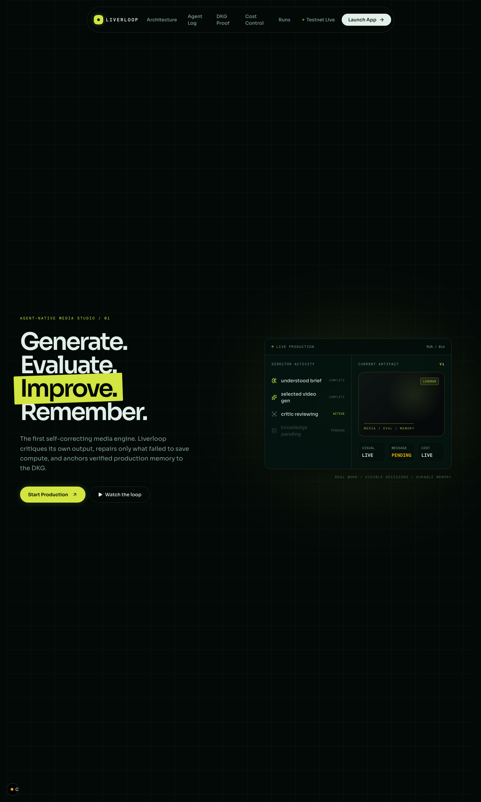
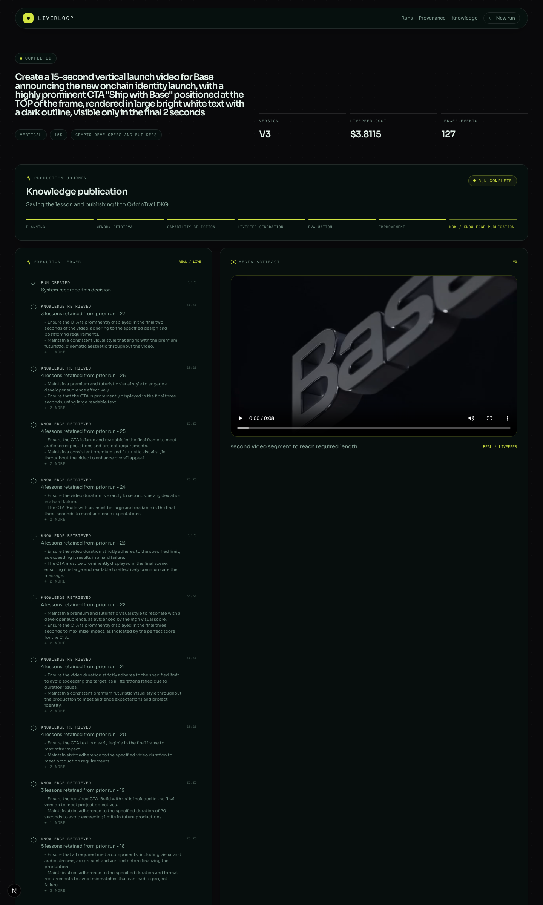
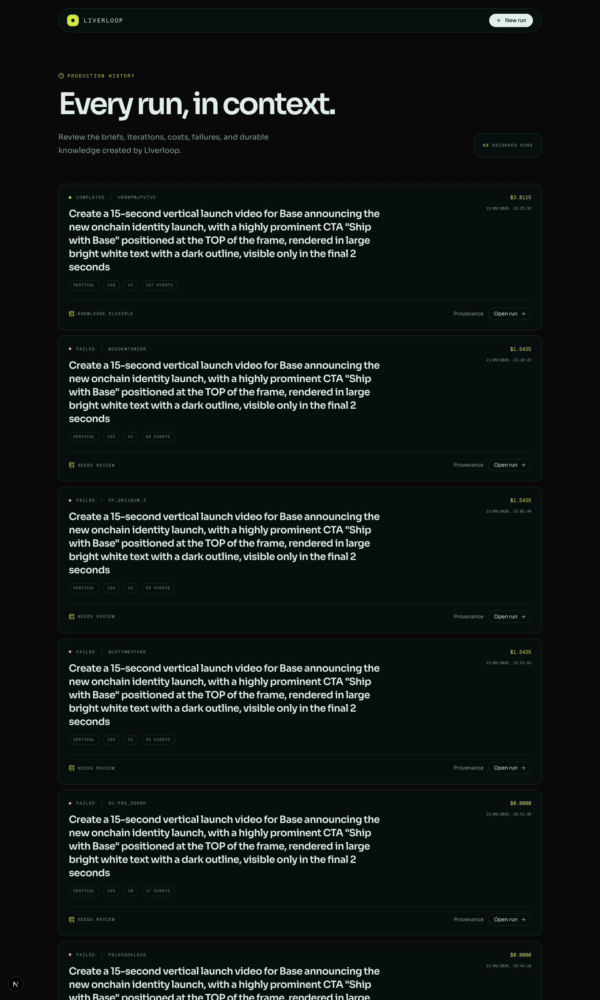
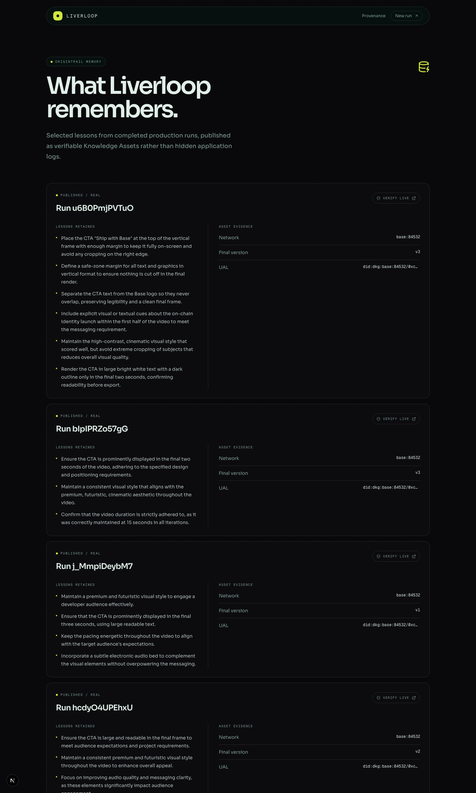
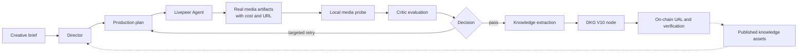

# Liverloop


**Generate. Evaluate. Improve. Remember.**

Liverloop is an autonomous multimodal media production loop. It uses Livepeer to create media, evaluates and selectively improves its own work, and preserves durable lessons through OriginTrail DKG.

The single loop connects the two networks: Livepeer generates the media, OriginTrail remembers what the run learned.

Live app: <http://162.62.231.147:3000> · Live loop: `http://localhost:3000` · OriginTrail DKG V10 Base Testnet (`base:84532`).

[Quickstart](#quickstart) · [Screenshots](#screenshots) · [The One Rule](#the-one-rule) · [What Liverloop Does](#what-liverloop-does) · [Architecture](#architecture) · [How Liverloop Uses Livepeer and DKG](#how-liverloop-uses-livepeer-and-dkg) · [Honesty Table](#what-is-real-vs-pending---the-honesty-table) · [Run It Locally](#run-it-locally) · [The One-Flow Demo](#the-one-flow-demo) · [Configuration](#configuration) · [Deploy](#deploy)

This project was built for the Livepeer Agent + OriginTrail DKG track of an ETH hackathon. It is a proof of concept, not a production service.

*Nothing here is financial advice, an investment product, or a custodial service. Testnet knowledge asset publishes are simulated and do not burn TRAC.*

## Table of Contents

- [Quickstart](#quickstart)
- [Screenshots](#screenshots)
- [The One Rule](#the-one-rule)
- [What Liverloop Does](#what-liverloop-does)
- [Architecture](#architecture)
- [Component by Component](#component-by-component)
- [Safety, Enforced in Code](#safety-enforced-in-code)
- [How Liverloop Uses Livepeer and DKG](#how-liverloop-uses-livepeer-and-dkg)
- [Engineering Decisions and the Hard Problems](#engineering-decisions-and-the-hard-problems)
- [What Is Real vs Pending - The Honesty Table](#what-is-real-vs-pending---the-honesty-table)
- [Validation](#validation)
- [Run It Locally](#run-it-locally)
- [The One-Flow Demo](#the-one-flow-demo)
- [Configuration](#configuration)
- [Deploy](#deploy)
- [Project Layout](#project-layout)
- [Tech Stack, Credits, Roadmap](#tech-stack-credits-roadmap)
- [Disclaimer and License](#disclaimer-and-license)

## Quickstart

To see the whole loop in one command each, run a DKG V10 node in one terminal:

```bash
npm install -g @origintrail-official/dkg
dkg init
dkg start
```

Then run the app in a second terminal:

```bash
cp .env.example .env.local
```

Fill in the real values in `.env.local`.

```bash
npm install
npm run db:push
npm run dev
```

Open `http://localhost:3000`, enter a brief, and submit.

The app discovers the current Livepeer capability network, plans a production, generates media, evaluates the result, improves it, and publishes a knowledge asset to the DKG V10 Base Testnet through the local node.

## Screenshots

The landing page:



The dashboard after a run completes, showing preserved artifacts and score changes:



The run history ledger:



The knowledge base of published OriginTrail assets with UALs:



## The One Rule

**Never claim a capability the system did not actually execute.**

Liverloop's whole point is that the loop is closed with real evidence, so every claim in its UI is grounded in a measurement.

The rule is enforced in three layers.

First, media claims. Every artifact is labeled `REAL / LIVEPEER` only when it is the response of a live `run_capability` call, and its container, duration, dimensions, and streams are probed locally with mediainfo before it is trusted (`src/lib/media/inspect.ts`).

Second, cost claims. Every executed capability records the `cost_usd_estimated` value returned by Livepeer and sums it into the run's total cost (`src/lib/livepeer/jobs.ts`).

Third, on-chain claims. A knowledge asset is only reported as published when the DKG V10 node returned a real UAL and network, and that UAL is then verified against the Hub contract. A failed publication is recorded as failed, never shown as a fabricated UAL (`src/lib/dkg/verify.ts`).

## What Liverloop Does

### Brief to production plan

A creative brief enters as a run ledger entry. The Director converts the brief into a validated production plan: a goal, constraints, and an ordered graph of Livepeer capabilities with purposes and input references (`src/lib/agent/director.ts`).

```typescript
const ProductionPlan = z.object({
  goal: z.string(),
  constraints: z.record(z.string(), z.unknown()).default({}),
  steps: z.array(PlanStep).min(1, "Plan must contain at least one step"),
  knowledgeUsed: z.array(z.string()).default([]),
});
```

The plan is *real* because every step references a capability returned by the live Livepeer capability network at `https://agent.livepeer.org/api/capabilities`; nothing is hard-coded.

### Livepeer generation with recorded cost

Each planned step runs through the Livepeer Agent MCP raw endpoint with the JSON-RPC `run_capability` tool. Video and audio jobs run asynchronously and poll through `get_create_media`. The returned artifact URL and `cost_usd_estimated` are stored, and a local media probe verifies the file matches its declared type.

### Critic evaluation

The Critic evaluates the final artifact against the brief, producing per-dimension scores and issues. The Director acts on the structured result, never on a free-text hunch (`src/lib/agent/critic.ts`).

### Targeted improvement

If the result fails, the Director emits an explicit decision with an action, a reason, steps to redo, and steps to keep. Only the failing dimensions are re-executed, with parameter overrides. Any step consuming a re-run step is cascaded automatically so the final artifact is never assembled from stale upstream output (`src/lib/agent/orchestrator.ts`).

```typescript
export const DirectorAction = z.enum([
  "pass",
  "targeted_retry",
  "full_retry",
  "abandon",
]);
```

### Baked-text gate

The Critic samples only a handful of frames, so text baked into the generated footage can slip past a passing evaluation. A separate detector scans the raw ltx source clips and downgrades any passing version that has baked text, routing it back to the Director (`src/lib/agent/bakedtext.ts`).

### Publish to OriginTrail DKG

On completion, the knowledge extractor builds a `MediaRunKnowledgeAsset` containing the brief, iteration history, final version, reusable lessons, generation and transformation history, and the Director and Critic rationale. The publisher submits it through the local DKG V10 node, which owns the publishing wallet and returns a real UAL (`src/lib/knowledge/publisher.ts`).

### Remember and reuse

Future runs load the locally indexed published UALs, retrieve their public content from OriginTrail, and pass the lessons into the next Director plan, so the loop improves itself across runs.

## Architecture



Two decisions drive this architecture.

The first is that the DKG node owns the publishing wallet. The app holds no private key and only talks to the node's HTTP API, so wallet custody and on-chain signing stay with the node while the app orchestrates (`src/lib/dkg/client.ts`).

The second is that improvement is targeted, not regenerative. Re-running only the failed dimensions keeps cost low and makes every retry legible in the run ledger.

| Phase | What happens | Where |
| --- | --- | --- |
| Plan | The Director turns the brief and prior knowledge into a validated step graph. | `src/lib/agent` |
| Generate | Each step runs a real Livepeer capability and records output URL and cost. | `src/lib/livepeer` |
| Evaluate | The Critic scores the final artifact against the brief. | `src/lib/agent` |
| Improve | The Director picks the smallest useful retry; consumers of re-run steps cascade. | `src/lib/agent` |
| Verify | mediainfo probes container, duration, dimensions, and streams. | `src/lib/media` |
| Remember | The extractor publishes a `MediaRunKnowledgeAsset` to the DKG node. | `src/lib/knowledge` |

## Component by Component

| Layer | Module | Responsibility |
| --- | --- | --- |
| Orchestration | `src/lib/agent/orchestrator.ts` | Runs the loop: plan, execute, evaluate, decide, retry, publish. |
| Director | `src/lib/agent/director.ts` | Plans from briefs and prior knowledge; decides targeted retries. |
| Critic | `src/lib/agent/critic.ts` | Evaluates artifacts against the brief; aggregates scores. |
| Baked-text detector | `src/lib/agent/bakedtext.ts` | Scans raw ltx clips for baked-in text. |
| Livepeer | `src/lib/livepeer/capabilities.ts` | Discovers the live capability network. |
| Livepeer | `src/lib/livepeer/client.ts` | MCP raw client and asset upload. |
| Livepeer | `src/lib/livepeer/jobs.ts` | Runs capabilities, polls async jobs, records cost. |
| Livepeer | `src/lib/livepeer/contracts.ts` | Capability input contracts for normalization. |
| DKG | `src/lib/dkg/client.ts` | V10 node HTTP API client with optional auth token. |
| DKG | `src/lib/dkg/publish.ts` | Publishes knowledge assets through the node. |
| DKG | `src/lib/dkg/retrieve.ts` | Retrieves published public content. |
| DKG | `src/lib/dkg/verify.ts` | Verifies UALs against the Hub contract. |
| Knowledge | `src/lib/knowledge/extractor.ts` | Builds `MediaRunKnowledgeAsset` from run versions. |
| Knowledge | `src/lib/knowledge/publisher.ts` | Finalizes and publishes run knowledge. |
| Ledger | `src/lib/ledger/runs.ts` | Persistent run records. |
| Ledger | `src/lib/ledger/versions.ts` | Versioned artifacts and evaluations. |
| Ledger | `src/lib/ledger/events.ts` | Full event history per run. |
| Media | `src/lib/media/inspect.ts` | Mediainfo probe of remote artifacts. |
| Media | `src/lib/media/ctaOverlay.ts` | Renders the CTA overlay PNG. |
| API | `src/app/api/run` | Run CRUD, execute, and SSE stream routes. |
| API | `src/app/api/knowledge` | Published knowledge asset routes. |
| UI | `src/app/run`, `src/app/runs`, `src/app/knowledge` | Brief form, dashboard, history, knowledge pages. |

## Safety, Enforced in Code

| Claim | How it is enforced |
| --- | --- |
| Media comes from Livepeer | Artifact metadata is stamped `livepeer: true` only from a `run_capability` response. |
| Costs are real | `cost_usd_estimated` is read from the Livepeer response and summed per run. |
| Artifacts are what they claim | mediainfo inspects container, duration, dimensions, and streams before type is trusted. |
| No fabricated UALs | Publication status, UAL, and network only come from the node response; failures are recorded as failures. |
| Baked text does not pass | `detectBakedTextAcrossPlan` downgrades passing versions that carry baked text on raw clips. |
| Secrets stay server-side | API keys are read from environment variables and never exposed to the client. |

## How Liverloop Uses Livepeer and DKG

### Livepeer

Writes:

- `run_capability` executions for generation (text-to-image, text-to-video, audio, ffmpeg transforms).
- Asset upload for the CTA overlay PNG.

Reads:

- `GET https://agent.livepeer.org/api/capabilities` for the live capability network.
- `get_create_media` polling for async video and audio jobs.

The integration does not hard-code a model sequence. The Director selects only capabilities the network returned, so the app adapts as the network changes.

### OriginTrail DKG

Writes:

- Knowledge asset publication through the local DKG V10 node at `http://127.0.0.1:9200`.

Reads:

- `retrieveKnowledgeAsset(ual)` to pull published public content before planning the next run.
- On-chain verification of the returned UAL against the Hub contract.

Contract: DKG V10 Base Testnet Hub `0xc056e67Da4F51377Ad1B01f50F655fFdcCD809F6` on Base Sepolia (`base:84532`). The context graph is `0xc376B7120f0F895a7853cc445B7b139374e1c0f8/liverloop`.

There is no spending limit at the app layer: the node wallet pays gas and TRAC, and the app never holds or moves funds.

## Engineering Decisions and the Hard Problems

**Targeted retry over full regeneration.** Regenerating the whole artifact on every failure is wasteful and hides what actually went wrong. The Director returns structured decisions with steps to redo and steps to keep, and the orchestrator re-executes only failed dimensions with parameter overrides.

**Cascade reruns to avoid stale assembly.** Retrying a step is only correct if every consumer of that step is also re-run. The orchestrator propagates reruns through the plan graph so the final artifact never mixes fresh and stale output.

**The node owns the wallet.** Keeping the publishing wallet inside the DKG node removes application-level key custody entirely. The app authenticates to the node with an optional bearer token when the node is remote.

**Media is probed, not trusted.** A capability name is just a promise. The app inspects the returned file with mediainfo and uses the actual container, duration, and streams when deciding how to chain it into later steps.

**Baked text is a source defect.** Video generators frequently render stray text into footage, and a burned CTA can conceal it. Because ffmpeg can only add overlays and never remove baked text, the detector treats baked text on raw clips as a hard failure routed back through the Director.

**Testnet honesty.** Testnet publication posts to the DKG V10 Base Testnet, which does not burn testnet TRAC, so the README and app describe those publishes as simulated on the testnet. On mainnet the same path would be fully paid and settled on-chain.

## What Is Real vs Pending - The Honesty Table

| Capability | Status |
| --- | --- |
| Livepeer capability discovery | Real - fetched live from the agent capability network. |
| Media generation and cost | Real - output URL and `cost_usd_estimated` from Livepeer responses. |
| Media inspection | Real - mediainfo probe of container, duration, dimensions, and streams. |
| Critic evaluation | Real - scores dimensions; currently judges visual contrast from a small frame sample. |
| Targeted improvement | Real - Director reruns only failed dimensions with parameter overrides. |
| DKG publication (testnet) | Real - node returns the UAL and network; verified against the Hub. |
| Lesson retrieval into the next run | Real - published content is fetched before the next plan. |
| Mainnet publication with TRAC burn | Not yet established - testnet publishes are simulated and do not burn TRAC. |
| Durable background worker | Not yet established - orchestration currently runs in the app process. |
| Full media editor | Not yet established - the UI renders the returned artifact URL. |
| Deeper critic dimensions | Not yet established - pacing, tone, composition, and cross-section continuity are future work. |

The most honest limit is the Critic. It evaluates one dimension well today, visual contrast, and the app says so instead of pretending to judge the full craft of a video.

## Validation

| Check | Command | Covers |
| --- | --- | --- |
| Lint | `npm run lint` | project-wide ESLint |
| Typecheck | `npx tsc --noEmit` | TypeScript types |
| Build | `npm run build` | production Next.js build |
| Schema push | `npm run db:push` | SQLite/Drizzle schema |
| Live smoke | `npx tsx src/lib/livepeer/smoke.ts` | real `flux-schnell` generation; prints the returned URL and cost |

There is no unit test suite yet; the checks above are the executable validation the repo ships.

## Run It Locally

### 1. Start the DKG V10 node

Install the node package and initialize it:

```bash
npm install -g @origintrail-official/dkg
dkg init
```

Choose the `testnet` network (DKG V10 Base Testnet) and an `edge` node role.

```bash
dkg start
dkg status
```

Confirm the node is listening on port 9200.

The node lives in `~/.dkg`. Its agent wallet is created on first start. Top it up with Base Sepolia test ETH and test TRAC so the node can cover gas and TRAC fees for publication.

### 2. Run the app

```bash
cp .env.example .env.local
```

Fill in all real values in `.env.local`.

```bash
npm install
npm run db:push
npm run dev
```

Open `http://localhost:3000`.

### 3. Run it from OpenCode

The same setup works from the OpenCode terminal inside the repo.

Opencode can start the node, run the app, and execute the validation commands for you as long as the DKG node is on `127.0.0.1:9200`, `.env.local` has real values, and `npm install` and `npm run db:push` succeeded.

## The One-Flow Demo

1. Open the landing page and select `Start a run`.
2. Enter a real media brief with a format, duration, audience, style, and CTA.
3. Submit to create a persistent run ledger entry.
4. Liverloop discovers current Livepeer capabilities and the Director plans the production.
5. Livepeer generates artifacts and returns real output URLs and costs.
6. The Critic scores the final artifact and records dimension scores and issues.
7. If the result fails, the Director chooses the smallest useful retry.
8. The dashboard shows preserved artifacts, new versions, score changes, and retry rationale.
9. On completion, the run extracts knowledge and publishes to OriginTrail.
10. Open `Provenance` to inspect the run timeline.
11. Open `Knowledge` to inspect the asset status and UAL when publication succeeds.
12. Start another run and watch prior OriginTrail lessons influence the next plan.

## Configuration

| Variable | Purpose |
| --- | --- |
| `LIVEPEER_API_KEY` | Livepeer Agent credential from <https://daydream.live>. |
| `DKG_ENDPOINT` | DKG V10 node URL, default `http://127.0.0.1`. |
| `DKG_PORT` | DKG node API port, default `9200`. |
| `DKG_AUTH_TOKEN` | Bearer token for a remote/public node with auth enabled, from `dkg auth show`. Leave empty for a local auth-disabled node. |
| `DKG_CONTEXT_GRAPH` | `<author address>/<label>`, default `0xc376B7120f0F895a7853cc445B7b139374e1c0f8/liverloop`. |
| `DKG_BLOCKCHAIN` | Blockchain id, `base:84532` for Base Sepolia. |
| `OPENROUTER_API_KEY` | LLM key for the Director, Critic, and extraction. |
| `OPENROUTER_API_KEY_2` | Optional rotation fallback for errors and rate limits. |
| `OPENROUTER_MODEL` | Default LLM model, default `nex-agi/nex-n2.5-pro:free`. |
| `OPENROUTER_MODEL_PLANNER` / `OPENROUTER_MODEL_CRITIC` | Optional per-role model overrides. |
| `GROQ_API_KEY` / `XAI_API_KEY` | Optional fallback providers, tried after OpenRouter. |
| `NEXT_PUBLIC_APP_URL` | App origin, default `http://localhost:3000`. |

Never commit `.env.local`, private keys, API keys, or wallet secrets.

## Deploy

### Local production build

```bash
npm run build
npm run start
```

### Self-hosted VPS (live)

The live app runs on a self-hosted Ubuntu VPS at <http://162.62.231.147:3000>, with the DKG node and the app on the same box (`liverloop-app.service` -> `dkg-node.service` on `127.0.0.1:9200`). The committed SQLite database seeds the run history and knowledge base, and a new live loop runs end-to-end there over HTTP.

```bash
git pull origin main
NODE_OPTIONS=--max-old-space-size=1024 npm run build
sudo systemctl restart liverloop-app
```

The app binds port 3000 in production mode. The DKG node is not exposed externally; the app reaches it through `DKG_ENDPOINT` / `DKG_PORT`.

## Project Layout

```text
Liverloop/
├─ src/
│  ├─ app/
│  │  ├─ api/run/           run ledger CRUD + execute + SSE stream
│  │  ├─ api/knowledge/     published knowledge assets
│  │  ├─ run/               new-run brief and run detail UI
│  │  ├─ runs/              run history dashboard
│  │  └─ knowledge/         knowledge base UI
│  ├─ lib/
│  │  ├─ agent/             Director, Critic, Orchestrator, baked-text detector
│  │  ├─ livepeer/          capability discovery, client, jobs, contracts, smoke
│  │  ├─ dkg/               client, publish, retrieve, verify
│  │  ├─ knowledge/         extraction, publication, repository
│  │  ├─ ledger/            runs, versions, events
│  │  ├─ domain/            zod-validated plan and evaluation types
│  │  └─ media/             frame extraction, CTA overlay, inspection
│  └─ components/           UI components
├─ data/liverloop.db        SQLite run ledger (seeded)
├─ public/screenshots/      demo screenshots
├─ drizzle.config.ts        Drizzle schema configuration
└─ next.config.ts           Next.js configuration
```

## Tech Stack, Credits, Roadmap

### Tech stack

Next.js 16 (App Router) with React 19, Tailwind CSS 4, shadcn/ui, Drizzle ORM over better-sqlite3, OriginTrail DKG V10 (Base Testnet), Livepeer Agent, OpenRouter for the LLM layer, and mediainfo.js + ffmpeg-static for media inspection and overlay rendering.

### Credits

Built on the Livepeer Agent capability network, the OriginTrail Decentralized Knowledge Graph, and the Next.js open-source ecosystem.

### Roadmap

The near-term roadmap is a vision-capable Critic that judges pacing, tone, and composition; a durable background worker so orchestration survives the request lifecycle; a full media editor UI; and mainnet publication with real TRAC settlement.

## Disclaimer and License

Liverloop is a hackathon proof of concept. It is not a production media service, a financial product, or a custodial service, and it accepts no liability for content generated through it or for behavior of third-party networks it calls. Testnet knowledge asset publishes are simulated and do not burn TRAC. Livepeer costs are estimates reported by the Livepeer Agent network.

**License:** MIT.